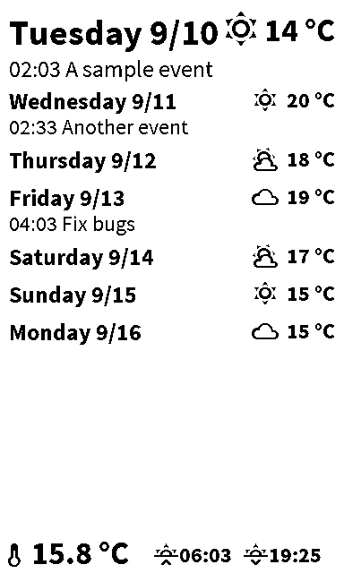

# Raspberry Pi Home Assistant E-ink Display

Displays calendar events from your caldav compatible calendar such as Nextcloud, data from Home Assistant API, uses the Waveshare E-ink displays.

## Requirements

- Raspberry Pi (should work on even Zero model, requires GPIO pins though)
- Waveshare E-ink Display (currently hardcoded to use [the 7.5 inch 3-color, model](https://www.waveshare.com/7.5inch-e-paper-hat-b.htm), can be modified to use other models)
- Python 3
- Home Assistant (running on your network, you need the Dark Sky sensor and Calendar component)

## Installation

- Make sure the display is connected
- Clone this repo
- `pip3 install -r requirements.txt`
- Copy `.env.example` to `.env`
- Modify `.env` to use your API credentials etc
- Git clone https://github.com/waveshare/e-Paper.git and symlink e-Paper/RaspberryPi%26JetsonNano/python/lib/waveshare_epd to waveshare_epd
- Run `eink.py` to update the screen

If you don't have the display connected, you can test to code by running `test.py` file.
